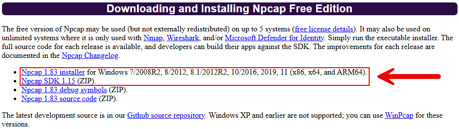
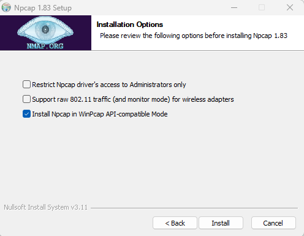

# pcap-to-json

A tool to convert pcap and pcapng files to JSON format.

## Installation Requirements

0. **Rust and Cargo**: Check to have rust and cargo installed. If not, install from https://rustup.rs/

### To use the PCAP Converter too:

1. **Npcap Runtime**: Download from https://npcap.com in the Downloads section.

   

2. **Npcap Runtime**: Check "Install Npcap in WinPcap API-compatible Mode" in the installer.

   

3. **Npcap SDK**: Download from https://npcap.com in the Downloads section, extract to `C:\Program Files\Npcap\sdk\`

## Build

```bash
cargo build
```

## Usage

### PCAP Converter:

Use this command to convert a pcap file to JSONL:

```
cargo run input.pcap output.jsonl
```

### DTC Report:

Extract DTCs from a log file into JSONL:

```
cargo run -- --extract-dtcs sample.log dtcs.jsonl
```

Extract DTC definitions from an Excel `.xlsx` file into JSONL:

```
cargo run -- --extract-dtcs-xlsx dtc_catalog.xlsx dtc_db.jsonl
```
