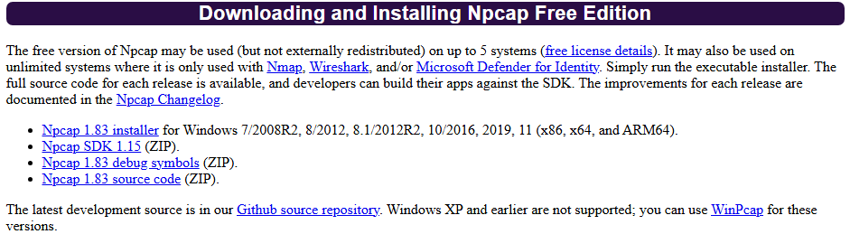

# pcap-to-json

A tool to convert pcap and pcapng files to JSON format.

## Installation Requirements

0. **Rust and Cargo**: Check to have rust and cargo installed. If not, install from https://rustup.rs/

1. **Npcap Runtime**: Download from https://npcap.com in the Downloads section

   

2. **Npcap Runtime**: Check "Install Npcap in WinPcap API-compatible Mode" in the installer

   

3. **Npcap SDK**: Download from https://npcap.com in the Downloads section, extract to `C:\Program Files\Npcap\sdk\`

## Build

```bash
cargo build
```

## Usage

Navigate to the directory where the executable is (i.e. target/debug) and run the executable as:

```
cargo run input.pcap output.jsonl
```

to print the packets to a file called "output.jsonl"
